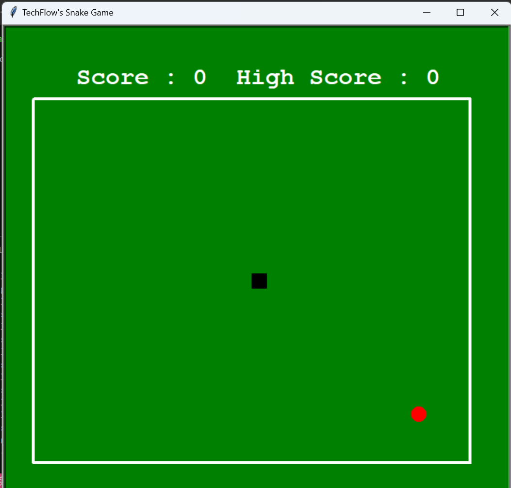

# TechFlow's Snake Game

Bienvenue dans **TechFlow's Snake Game**! Ce jeu est une version simple et amusante du classique jeu Snake, créée avec Python et Turtle Graphics.

## Prérequis

Assurez-vous d'avoir Python installé sur votre machine. Vous pouvez télécharger Python à partir de [python.org](https://www.python.org/downloads/).

## Installation

1. Clonez le dépôt de votre projet sur votre machine locale :

    ```sh
    git clone https://github.com/Christmp19/techflow-snake-game
    ```

2. Accédez au dossier du projet :

    ```sh
    cd techflow-snake-game
    ```

## Exécution du Jeu

Pour lancer le jeu, exécutez simplement le script Python :

    ```sh
    python snake_game.py
    ```

## Règles du Jeu

- Utilisez les flèches directionnelles de votre clavier pour déplacer le serpent :
  - **Flèche Haut** pour monter
  - **Flèche Bas** pour descendre
  - **Flèche Gauche** pour aller à gauche
  - **Flèche Droite** pour aller à droite
- Mangez la nourriture (cercles colorés) pour grandir et augmenter votre score.
- Évitez de toucher les murs ou votre propre corps, sinon c'est game over.
- Lorsque le jeu se termine, le jeu redémarre après quelques secondes.

## Personnalisation

Vous pouvez modifier les paramètres du jeu directement dans le fichier `snake_game.py` pour ajuster la vitesse du serpent, les couleurs, les formes, etc.

## Captures d'écran



## Contributions

Les contributions sont les bienvenues! Si vous souhaitez améliorer ce projet, n'hésitez pas à soumettre une pull request ou à ouvrir une issue sur GitHub.


---

Amusez-vous bien en jouant à **TechFlow's Snake Game**!
